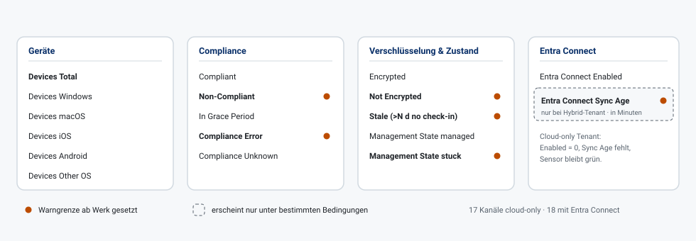
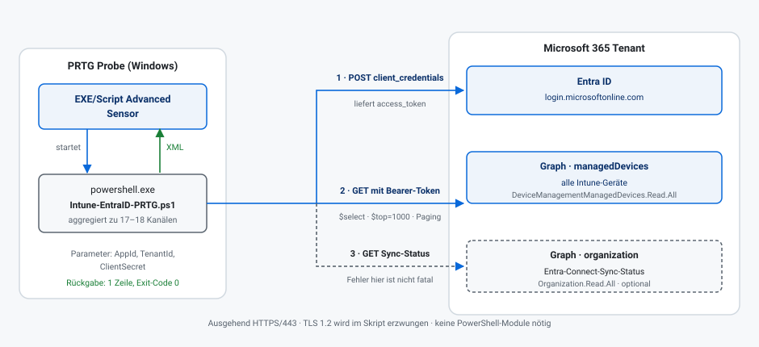
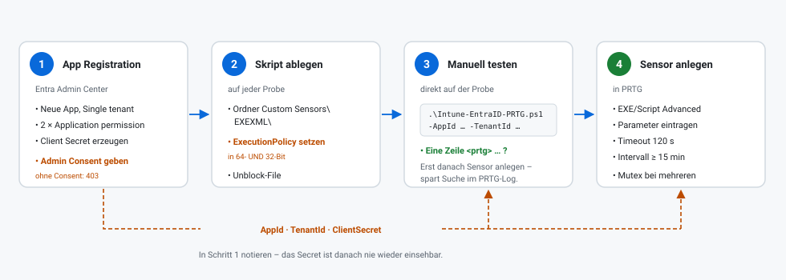

# entra-Health-Check-PRTG

PRTG **EXE/Script Advanced** Sensor für Microsoft **Intune** und **Entra ID (Azure AD) Connect Sync**.

Ein einzelnes PowerShell-Skript, keine externen Module. Es fragt die Microsoft Graph API
per OAuth2 Client Credentials ab und liefert 17–18 PRTG-Kanäle: Gerätezahlen nach
Betriebssystem, Compliance-Status, Verschlüsselung, „stale“ Geräte ohne Check-in,
hängende Management-States und das Alter des letzten Entra-Connect-Sync.



---

## Inhalt

1. [Schnellstart](#schnellstart)
2. [Was der Sensor macht](#1-was-der-sensor-macht)
3. [Voraussetzungen](#2-voraussetzungen)
4. [Einrichtung im Überblick](#3-einrichtung-im-überblick)
5. [Schritt 1: App Registration in Entra ID](#schritt-1-app-registration-in-entra-id)
6. [Schritt 2: Skript auf der Probe ablegen](#schritt-2-skript-auf-der-probe-ablegen)
7. [Schritt 3: Manuell testen](#schritt-3-manuell-testen)
8. [Schritt 4: Sensor in PRTG anlegen](#schritt-4-sensor-in-prtg-anlegen)
9. [Parameter-Referenz](#4-parameter-referenz)
10. [Kanal-Referenz](#5-kanal-referenz)
11. [Grenzwerte anpassen](#6-grenzwerte-anpassen)
12. [Stolperfallen](#7-stolperfallen)
13. [Troubleshooting](#8-troubleshooting)
14. [Sicherheitshinweise](#9-sicherheitshinweise)
15. [Performance und Skalierung](#10-performance-und-skalierung)
16. [Getestete Szenarien](#11-getestete-szenarien)

---

## Schnellstart

1. App Registration in Entra ID anlegen, Application Permissions
   `DeviceManagementManagedDevices.Read.All` + `Organization.Read.All` erteilen und
   **Admin Consent** geben.
2. `Intune-EntraID-PRTG.ps1` auf der PRTG-Probe ablegen unter
   `C:\Program Files (x86)\PRTG Network Monitor\Custom Sensors\EXEXML\`
3. Manuell testen:
   ```powershell
   .\Intune-EntraID-PRTG.ps1 -AppId '<client-id>' -TenantId '<tenant-id>' -ClientSecret '<secret>'
   ```
   Erwartet wird eine einzelne Zeile, die mit `<prtg>` beginnt und mit `</prtg>` endet.
4. In PRTG einen Sensor **EXE/Script Advanced** anlegen, das Skript auswählen und
   die Parameter setzen.

Die ausführliche Fassung steht weiter unten ab [Einrichtung im Überblick](#3-einrichtung-im-überblick).

---

## 1. Was der Sensor macht

Das Skript holt sich per **OAuth2 Client Credentials** ein Graph-Token und fragt
damit zwei Endpunkte ab:



| Endpunkt | Wofür | Berechtigung |
|---|---|---|
| `/v1.0/deviceManagement/managedDevices` | Alle Intune-Geräte, mit Paging über `@odata.nextLink` | `DeviceManagementManagedDevices.Read.All` |
| `/v1.0/organization` | `onPremisesSyncEnabled` und `onPremisesLastSyncDateTime` | `Organization.Read.All` (optional) |

Daraus werden Zählkanäle gebildet. Es werden **keine Gerätedaten gespeichert oder
ausgegeben** – nur aggregierte Zahlen. Die XML-Ausgabe bleibt dadurch auch bei
5.000 Geräten bei rund 2 KB.

Ausgegeben wird eine einzige Zeile reines PRTG-XML auf stdout, ohne XML-Prolog:

```xml
<prtg><result><channel>Devices Total</channel><value>6</value><unit>Count</unit></result>…<text>6 Geraete, 1 non-compliant, 2 stale</text></prtg>
```

---

## 2. Voraussetzungen

| | |
|---|---|
| **PRTG** | Beliebige aktuelle Version mit Sensortyp *EXE/Script Advanced* |
| **Probe** | Windows mit Windows PowerShell 5.1 (Standard) oder PowerShell 7 |
| **Netzwerk** | Ausgehend HTTPS (443) von der Probe zu `login.microsoftonline.com` und `graph.microsoft.com` |
| **Lizenz** | Intune-Lizenzierung im Tenant; für den Sync-Teil ein konfigurierter Entra Connect (optional) |
| **Module** | Keine. Das Skript nutzt nur Bordmittel (`Invoke-RestMethod`). |

Das Skript erzwingt selbst **TLS 1.2**, damit es auch auf Server 2012 R2 / 2016
gegen `login.microsoftonline.com` funktioniert.

---

## 3. Einrichtung im Überblick



Die drei Werte aus Schritt 1 sind genau das, was in Schritt 3 und 4 wieder
eingetragen wird. Das Client Secret ist **nach dem Anlegen nie wieder einsehbar** –
sofort notieren.

### Schritt 1: App Registration in Entra ID

1. [Entra Admin Center](https://entra.microsoft.com) öffnen →
   **Identity** → **Applications** → **App registrations** → **New registration**
2. Name vergeben, z. B. `PRTG-Intune-HealthCheck`.
   *Supported account types*: **Single tenant**. Keine Redirect URI nötig.
3. Auf der Übersichtsseite notieren:
   - **Application (client) ID** → später `-AppId`
   - **Directory (tenant) ID** → später `-TenantId`
4. **Certificates & secrets** → **New client secret** → Laufzeit wählen →
   **Value** sofort kopieren → später `-ClientSecret`.
   > Ablaufdatum notieren und eine Wiedervorlage setzen. Läuft das Secret ab,
   > geht der Sensor mit `AADSTS7000215` auf Fehler.
5. **API permissions** → **Add a permission** → **Microsoft Graph** →
   **Application permissions** (nicht *Delegated*!) → folgende setzen:

   | Permission | Wofür | Pflicht |
   |---|---|---|
   | `DeviceManagementManagedDevices.Read.All` | Intune-Geräte | ja |
   | `Organization.Read.All` | Entra-Connect-Sync-Status | optional |

6. **Wichtig:** auf **Grant admin consent for \<Tenant\>** klicken.
   Ohne Admin Consent liefert Graph `403 Forbidden`.

> `Directory.Read.All` funktioniert alternativ zu `Organization.Read.All`,
> ist aber deutlich weitreichender. Nimm die kleinere Berechtigung.

Fehlt `Organization.Read.All`, läuft der Geräteteil trotzdem sauber durch –
der Sensor bleibt grün und schreibt den Grund in die Sensor-Meldung
(`Sync-Status nicht lesbar: …`).

### Schritt 2: Skript auf der Probe ablegen

Das Skript gehört auf **jede Probe**, die den Sensor ausführen soll, in:

```
C:\Program Files (x86)\PRTG Network Monitor\Custom Sensors\EXEXML\
```

Der Dateiname `Intune-EntraID-PRTG.ps1` taucht danach im Sensor-Dropdown auf.

#### ExecutionPolicy

Das ist die häufigste Fehlerquelle. PRTG startet das Skript über `powershell.exe`,
und je nach Probe-Architektur ist das der 64-Bit- **oder** der 32-Bit-Host.
Setze die Policy daher in **beiden**:

```powershell
# 64-Bit
Set-ExecutionPolicy -ExecutionPolicy RemoteSigned -Scope LocalMachine

# 32-Bit (aus einer 64-Bit-Konsole heraus starten)
& "$env:WINDIR\SysWOW64\WindowsPowerShell\v1.0\powershell.exe" `
    -Command "Set-ExecutionPolicy -ExecutionPolicy RemoteSigned -Scope LocalMachine"
```

Kam die Datei per Download oder E-Mail, hat sie eventuell die
Mark-of-the-Web-Markierung und wird trotz `RemoteSigned` blockiert:

```powershell
Unblock-File 'C:\Program Files (x86)\PRTG Network Monitor\Custom Sensors\EXEXML\Intune-EntraID-PRTG.ps1'
```

### Schritt 3: Manuell testen

**Immer zuerst von Hand auf der Probe testen**, bevor du den Sensor anlegst.
Das spart die Fehlersuche im PRTG-Log.

```powershell
cd 'C:\Program Files (x86)\PRTG Network Monitor\Custom Sensors\EXEXML'
.\Intune-EntraID-PRTG.ps1 -AppId '<client-id>' -TenantId '<tenant-id>' -ClientSecret '<secret>'
```

**Gut** sieht so aus – eine einzige Zeile, beginnend mit `<prtg>`:

```xml
<prtg><result><channel>Devices Total</channel><value>6</value><unit>Count</unit></result>…</prtg>
```

**Schlecht** ist alles andere, insbesondere:

```xml
<prtg><error>1</error><text>Token-Abruf fehlgeschlagen: …</text></prtg>
```

Das ist kein Absturz, sondern die geordnete Fehlermeldung des Skripts.
Der Text nennt den Grund – siehe [Troubleshooting](#8-troubleshooting).

Zum Gegenprüfen, ob die Ausgabe wirklich wohlgeformtes XML ist:

```powershell
$o = .\Intune-EntraID-PRTG.ps1 -AppId '<id>' -TenantId '<tid>' -ClientSecret '<secret>'
[xml]$x = $o
$x.prtg.result | Format-Table channel, value -AutoSize
```

### Schritt 4: Sensor in PRTG anlegen

1. Gerät wählen (sinnvoll: ein Gerät `Microsoft 365` / `Cloud`, nicht die Probe selbst)
2. **Add Sensor** → nach `EXE/Script Advanced` suchen
3. Einstellungen:

   | Feld | Wert |
   |---|---|
   | **EXE/Script** | `Intune-EntraID-PRTG.ps1` |
   | **Parameters** | siehe unten |
   | **Environment** | *Default* |
   | **Security Context** | *Use security context of probe service* |
   | **Mutex Name** | z. B. `GraphApi` – serialisiert mehrere Graph-Sensoren |
   | **Timeout (Sec.)** | `120` (Default 60 reicht bei großen Tenants nicht) |
   | **Scanning Interval** | `15 Minuten` oder größer |

4. Die Parameter konkret – **Werte in Anführungszeichen** setzen, das Secret
   enthält häufig Sonderzeichen:

   ```
   -AppId "11111111-2222-3333-4444-555555555555" -TenantId "aaaaaaaa-bbbb-cccc-dddd-eeeeeeeeeeee" -ClientSecret "abc~1DEF..."
   ```

   Optional zusätzlich:

   ```
   -StaleDeviceDays 30 -StaleDeviceWarnCount 10 -MaxSyncLagHours 3
   ```

> **Intervall:** Die Daten ändern sich langsam, und jeder Lauf zieht **alle**
> Geräte durch Graph. Unter 15 Minuten bringt keinen Mehrwert, kostet aber
> Laufzeit und Graph-Requests. 30 oder 60 Minuten sind bei großen Tenants
> die bessere Wahl.

---

## 4. Parameter-Referenz

| Parameter | Pflicht | Default | Bedeutung |
|---|---|---|---|
| `-AppId` | ja | – | Application (Client) ID der App Registration |
| `-TenantId` | ja | – | Directory (Tenant) ID |
| `-ClientSecret` | ja | – | Client Secret **Value** (nicht die Secret-ID!) |
| `-StaleDeviceDays` | nein | `30` | Ab wie vielen Tagen ohne Check-in ein Gerät als *stale* gilt |
| `-StaleDeviceWarnCount` | nein | `10` | Ab wie vielen stale Devices der Kanal auf Warnung geht |
| `-MaxSyncLagHours` | nein | `3` | Ab welchem Alter des letzten Entra-Connect-Sync gewarnt wird |
| `-GraphBaseUri` | nein | `https://graph.microsoft.com` | Nur für Sondertenants (US Gov, China) anzupassen |

---

## 5. Kanal-Referenz

| Kanal | Bedeutung | Default-Grenzwert |
|---|---|---|
| `Devices Total` | Alle Intune managed devices | – |
| `Devices Windows` / `macOS` / `iOS` / `Android` / `Other OS` | Aufschlüsselung nach `operatingSystem` | – |
| `Compliant` | `complianceState = compliant` | – |
| `Non-Compliant` | `complianceState = noncompliant` | **Warnung ab > 0** |
| `In Grace Period` | Noch in der Compliance-Karenzzeit | – |
| `Compliance Error` | `error` oder `conflict` | **Warnung ab > 0** |
| `Compliance Unknown` | `unknown` – meist Geräte, die sich nie gemeldet haben | – |
| `Encrypted` | `isEncrypted = true` | – |
| `Not Encrypted` | `isEncrypted = false` | **Warnung ab > 0** |
| `Stale (>N d no check-in)` | `lastSyncDateTime` älter als N Tage **oder** nie gesetzt | Warnung ab `StaleDeviceWarnCount` |
| `Management State managed` | Sauber verwaltete Geräte | – |
| `Management State stuck` | `retirePending`, `retireFailed`, `wipePending`, `wipeFailed`, `unhealthy`, `deletePending`, `retireIssued`, `wipeIssued` | **Warnung ab > 0** |
| `Entra Connect Enabled` | `1` = Hybrid-Tenant, `0` = Cloud-only oder nicht lesbar | – |
| `Entra Connect Sync Age` | Alter des letzten Sync **in Minuten** | Warnung ab `MaxSyncLagHours × 60` |

Hinweise zur Interpretation:

- **`Stale` zählt `lastSyncDateTime`, nicht das Enrollment-Datum.** Ein vor zwei
  Jahren eingerolltes, aber täglich eincheckendes Gerät ist gesund und zählt nicht.
- **`Encrypted` + `Not Encrypted` ergibt nicht zwangsläufig `Devices Total`.**
  Bei Geräten, für die Intune kein `isEncrypted` liefert (häufig bei iOS/Android),
  ist der Wert `null` und wird in keinem der beiden Kanäle gezählt. Das ist
  erwartetes Verhalten, kein Zählfehler.
- **`Other OS`** ist die Restmenge (`Total` minus die vier bekannten Gruppen) und
  enthält z. B. Linux, ChromeOS oder Geräte ohne gesetztes `operatingSystem`.

---

## 6. Grenzwerte anpassen

Das Skript setzt nur sinnvolle Startwerte. **Ändere Limits nach dem ersten Lauf
direkt in PRTG** (Kanal → *Edit* → *Limits*), nicht im Skript – so bleiben sie
bei einem Skript-Update erhalten.

Typische Anpassung: `Non-Compliant` mit Warnung ab `> 0` ist in größeren
Umgebungen zu streng. Realistischer ist ein Schwellwert relativ zur Flottengröße,
z. B. Warnung ab 5 % der Geräte.

---

## 7. Stolperfallen

### Der `Stale`-Kanalname enthält den Parameterwert

Der Kanal heißt `Stale (>30 d no check-in)`. Änderst du später
`-StaleDeviceDays` auf z. B. 14, heißt der Kanal `Stale (>14 d no check-in)` –
und **PRTG legt einen neuen Kanal an**. Der alte bleibt mit seiner Historie
bestehen, bekommt aber keine Daten mehr.

Willst du den Wert ändern und die Historie behalten, ist das nicht möglich;
entscheide dich möglichst vor dem Produktivstart für einen Wert.

### `Entra Connect Sync Age` erscheint nur bedingt

Der Kanal wird nur ausgegeben, wenn `onPremisesSyncEnabled = true` **und** ein
Zeitstempel geliefert wird. PRTG legt Kanäle beim **ersten** Scan an.

- Ist der Tenant beim ersten Scan Cloud-only, fehlt der Kanal dauerhaft. Kommt
  später ein Entra Connect dazu, erscheint er beim nächsten Scan automatisch.
- Fällt der Sync-Status später weg (z. B. Rechte entzogen), zeigt PRTG den
  Kanal weiter an, aber ohne neue Werte.

`Entra Connect Enabled` ist deshalb der verlässliche Kanal, um zu sehen,
ob überhaupt ein Hybrid-Sync erkannt wird.

### Kanalnamen sind bewusst ohne Umlaute

Die Konsolen-Codepage beim Aufruf durch die Probe kann sonst kaputte Zeichen
erzeugen. **Das Skript ist reines ASCII – bitte beim Bearbeiten so lassen.**
(Diese Dokumentation hier ist UTF-8 und darf Umlaute haben.)

---

## 8. Troubleshooting

Der Sensor fällt fast nie mit „premature end of data“ aus: bei Fehlern gibt das
Skript bewusst gültiges Fehler-XML aus und beendet sich mit Exit-Code 0, damit
**PRTG die Klartext-Meldung anzeigt**. Die Meldung steht im Sensor unter
*Last Message*.

| Meldung / Symptom | Ursache | Lösung |
|---|---|---|
| `Token-Abruf fehlgeschlagen: … AADSTS7000215` | Client Secret falsch oder abgelaufen | Neues Secret erzeugen, Sensor-Parameter aktualisieren |
| `Token-Abruf fehlgeschlagen: … AADSTS700016` | `AppId` falsch oder App im falschen Tenant | Client-ID und Tenant-ID prüfen |
| `Token-Abruf fehlgeschlagen: … AADSTS90002` | `TenantId` existiert nicht | Directory (Tenant) ID prüfen |
| `Graph-Abfrage fehlgeschlagen (403)` auf `managedDevices` | `DeviceManagementManagedDevices.Read.All` fehlt oder kein Admin Consent | Permission als **Application permission** setzen + Admin Consent |
| `Sync-Status nicht lesbar: … (403)` | `Organization.Read.All` fehlt | Permission ergänzen – oder ignorieren, der Rest funktioniert |
| `Kein Entra Connect (Cloud-only Tenant).` | Kein Fehler | Tenant hat keinen Hybrid-Sync; Meldung ist rein informativ |
| Sensor: *Script not found* | Skript liegt nicht im EXEXML-Ordner der **ausführenden** Probe | Datei auf die richtige Probe kopieren |
| Sensor: *… is not digitally signed* / *cannot be loaded* | ExecutionPolicy oder Mark-of-the-Web | `Set-ExecutionPolicy RemoteSigned` in 64- **und** 32-Bit, `Unblock-File` |
| Sensor: *Premature end of data* / *XML parse error* | Meist doch ein Fehler außerhalb des Skripts (Profil-Skript schreibt nach stdout) | Skript manuell auf der Probe testen; `-NoProfile` verwenden |
| Sensor: *Timeout* | Großer Tenant, Lauf dauert länger als der Timeout | Timeout auf 120–300 s erhöhen, Intervall vergrößern |
| `Paging-Abbruch nach 200 Seiten` | Mehr als 200 Graph-Seiten | Sollte bei `$top=1000` erst jenseits 200.000 Geräten auftreten |

Bei `429`/`503` (Graph-Throttling) wiederholt das Skript die Abfrage
automatisch bis zu dreimal mit steigender Wartezeit (2 s, 4 s, 6 s). Häufen sich
Timeouts, ist meist das Scan-Intervall zu kurz.

---

## 9. Sicherheitshinweise

- **Das Client Secret wird als Kommandozeilen-Parameter übergeben.** Es ist damit
  während der Laufzeit in der Prozessliste der Probe sichtbar und liegt in der
  PRTG-Konfiguration. Behandle die PRTG-Installation entsprechend als
  schützenswert und beschränke den Zugriff auf die Sensor-Einstellungen.
- Nutze **nur die beiden Read-Berechtigungen** oben. Die App braucht keinerlei
  Schreibrechte – weder auf Geräte noch auf das Verzeichnis.
- Lege für den Sensor eine **eigene App Registration** an, statt eine bestehende
  mitzubenutzen. So lässt sich der Zugang isoliert widerrufen.
- Setze eine **Wiedervorlage vor dem Ablauf des Secrets**. Alternativ lässt sich
  die App auf Zertifikats-Authentifizierung umstellen; das Skript unterstützt
  aktuell nur Client Secrets.
- Der Sensor liest ausschließlich und gibt **keine Geräte-, Benutzer- oder
  Standortdaten** aus – nur aggregierte Zahlen.

---

## 10. Performance und Skalierung

Das Skript ist auf große Tenants ausgelegt:

- **`$select`** holt nur die acht tatsächlich benötigten Felder statt des vollen
  Geräteobjekts – das reduziert die Payload erheblich.
- **`$top=1000`** hält die Seitenzahl klein.
- **Paging** über `@odata.nextLink` ist implementiert; ohne das fehlten ab
  dem 1001. Gerät schlicht alle weiteren.
- **Retry** bei `429`/`503` mit steigender Wartezeit.

Gemessen mit gemockter Graph-API (also ohne Netzwerk-Latenz), PowerShell 7.4:

| Geräte | Graph-Seiten | Reine Verarbeitungszeit | XML-Ausgabe |
|---|---|---|---|
| 6 | 2 | < 0,1 s | ~2,2 KB |
| 5.000 | 5 | ~2,3 s | ~2,0 KB |

Die reale Laufzeit wird von der Graph-Latenz dominiert, nicht von der
Verarbeitung. Rechne pro 1.000 Geräten grob mit einem zusätzlichen
Graph-Roundtrip. Bei mehr als ca. 5.000 Geräten den Sensor-Timeout auf
120–300 Sekunden setzen und das Intervall auf 30–60 Minuten.

Die XML-Ausgabe wächst **nicht** mit der Gerätezahl, da nur aggregiert wird.

---

## 11. Getestete Szenarien

Der Sensor wurde gegen eine gemockte Graph-API in folgenden Fällen geprüft –
in allen Fällen war die Ausgabe wohlgeformtes XML mit Exit-Code 0:

| Szenario | Ergebnis |
|---|---|
| Normalfall, gemischte Flotte über 2 Seiten | 18 Kanäle, Zählungen korrekt |
| Paging über 5 Seiten / 5.000 Geräte | `Devices Total = 5000` |
| Tenant ohne Geräte | Alle Kanäle `0`, kein Fehler |
| Cloud-only Tenant | `Entra Connect Enabled = 0`, Sync-Age-Kanal entfällt, Hinweistext gesetzt |
| `Organization.Read.All` fehlt (403) | Geräteteil vollständig, Sync-Fehler nur als Text |
| Ungültiges Secret (401) | Sauberes `<error>1</error>` mit Klartextmeldung |
| Gerät ohne `lastSyncDateTime` (`0001-01-01`) | Korrekt als *stale* gezählt |
| Abweichende Parameterwerte | Kanalname und Limits übernehmen die Werte |

Zusätzlich geprüft: keine Zeilenumbrüche in der Ausgabe (eine Zeile, auch bei
schmaler Konsole), kein XML-Prolog, reines ASCII ohne BOM, keine
PowerShell-7-only-Syntax – das Skript läuft damit auch unter Windows
PowerShell 5.1 auf der Probe.
